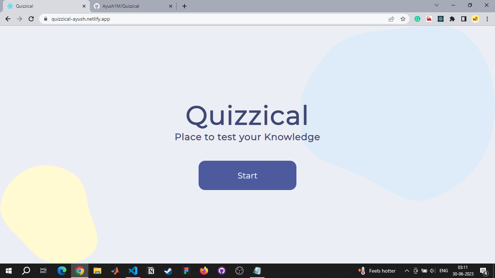
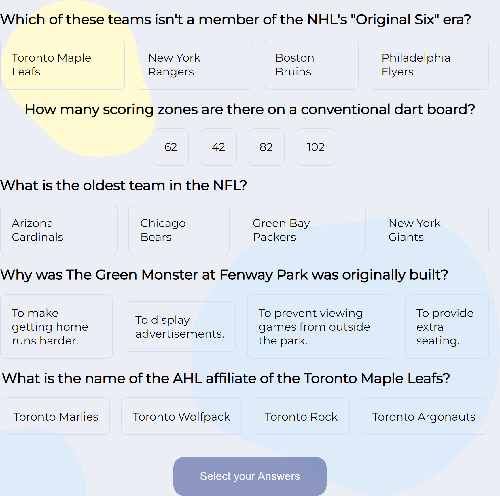
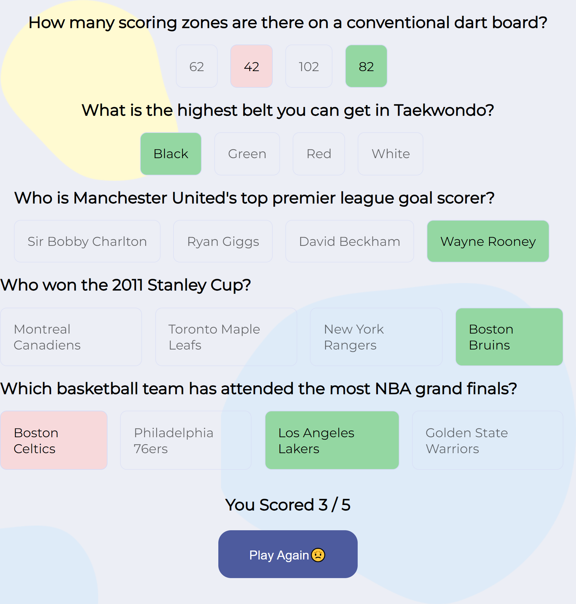

# Quizzical

## Table of Content

 * [Overview of the Project](#overview-of-the-project)
      * [Screenshot](#screenshot)
 * [Technologies I Used](#technologies-i-used)
 * [Whats the Approach?](#whats-the-approach)
 
# Overview of the Project

A Fun Quiz App to test your knowledge made with the concepts of React.js and React Router.

## Screenshot

### Welcome Page

### Quiz Page

### Result Page

## Technologies I Used

* React

## Whats the Approach?

- First I Fetched the quiz data from the Open trivia Database and map over the questions and answers to display it on the screen.
 
