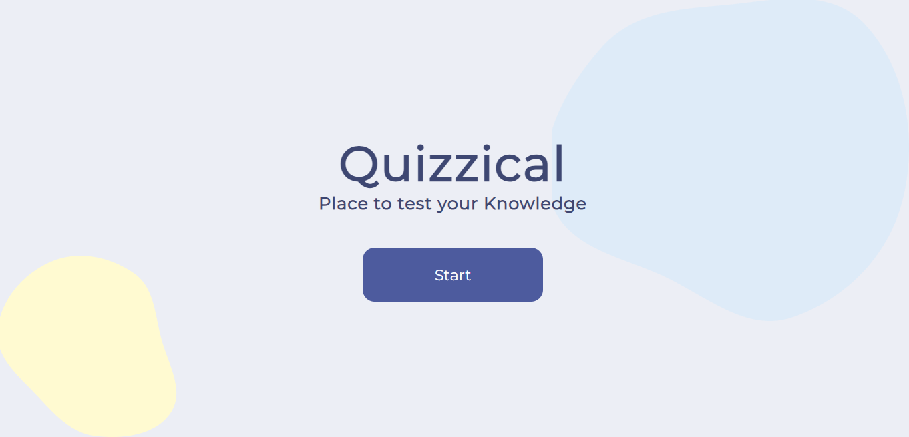

# Quizzical

## Table of Content

 * [Overview of the Project](#overview-of-the-project)
      * [Screenshot](#screenshot)
 * [Technologies I Used](#technologies-i-used)
 * [Whats the Approach?](#whats-the-approach)
 
# Overview of the Project

A Fun Quiz App to test your knowledge made with the concepts of React.js and React Router.

## Screenshot

### Welcome Page

### Quiz Page

### Result Page

## Technologies I Used

* React

## Whats the Approach?

- First I Fetched the quiz data from the Open trivia Database and map over the questions and answers to display it on the screen.
- The data I fetched consist of correct answers and incorrect answers. To tackle this problem I created a new array called allAnswers and pushed both correct answers and incorrect answers in that array and did shuffle all the answers using the sort method so that the correct answer is in a different position for each question.
- The next problem I faced is to select the answer and show correct and wrong answers so to tackle the problem I did the following:-
  -  I used radio buttons to show the answers options and mapped over the all answers array and created a handleClick function.
  -  To show the styling for correct, incorrect, and unselected answers after clicking the check answer button I used classnames package to join the different class names together which made it easier to show different styling easily.
 
